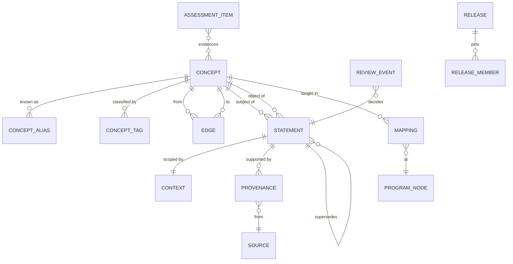

# Part III — The Knowledge Model

---

# 12. Universal Knowledge Graph

## 12.1 The logical model in one diagram



## 12.2 The four primitives

Everything reduces to four things. Any additional structure is a view over these.

| Primitive | Is | Is not | Mutable? |
|---|---|---|---|
| **Concept** | a referent — a thing that can be known about | a claim, a lesson, a page | identity never; tags/aliases yes |
| **Statement** | a contextual assertion relating concepts | a paragraph of prose | never — new version instead |
| **Edge** | a typed relationship between concepts | a claim about the world | never — new version instead |
| **Context** | the conditions under which a statement holds | a filter on queries | it is a value, not a row |

`Concept` and `Edge` form the **stable skeleton**. `Statement` carries **everything that can change**. That split is the single structural idea of the whole design: *identity is stable, belief is versioned, and the two are different tables.*

## 12.3 Why not RDF / triple store 🔬

Statements are subject-predicate-object, which is RDF's shape. Reasonable to ask why not adopt RDF wholesale.

**Rejected, for four reasons:**

1. **Context is second-class in RDF.** Scoping a triple requires reification or named graphs, both of which are cumbersome and neither of which is well supported by tooling. Context is our most load-bearing feature; it cannot be an add-on.
2. **Payloads are not triples.** A `PROCEDURE` has ordered steps with decision points; a `SKILL` has a rubric. Modelling those as triples explodes them into hundreds of statements and destroys their validatable shape.
3. **Operational cost.** A triple store is a second database with its own ops burden, for a product with no users.
4. **Interoperability is not a requirement today.** If it becomes one, the model **exports cleanly to RDF** — concepts are IRIs, statements are reified triples with context as a named graph. Adopting the export format as the storage format buys nothing now and costs plenty.

We take RDF's *insight* (separate entities from assertions) without its *encoding*.

---

# 13. Knowledge Object Model

## 13.1 The registry 🔒

**ADR-3 — Knowledge types are registry entries, not schema**

*Context.* You listed ~28 potential types (fact, principle, rule, formula, procedure, skill, technique, heuristic, pattern, diagnostic pattern, case study, example, counterexample, analogy, experiment, proof, theorem, law, precedent, authority, protocol, standard, performance piece, drill, assessment, project, misconception…). New domains will invent more.

*Decision.* A single `kind` discriminator plus a validated JSON payload, registered in a table. Base fields are shared; payload shape is per-kind.

*Alternatives.* (a) A table per type — rejected: every query unions N tables and adding a type is a migration. (b) One universal nullable schema — rejected: nothing is validatable; a missing field is indistinguishable from a bug. (c) Fixed enum of three — rejected: legal precedent is genuinely none of fact/procedure/skill, and distortion in the knowledge layer poisons everything downstream.

*Precedent.* This is exactly how `blockTypes.ts` + `blockSchemas.ts` already work in this codebase: one `type` string, one registry, per-type zod validation, `coerceSlot` handling shape repair. The pattern is proven here.

*Consequences.* Payload queries need JSON operators (acceptable — payloads are read whole, never filtered on). Adding `PRECEDENT` in 2029 is one file plus one registry line, with zero migrations and zero changes to edges, traversal, search, or the store interface.

```ts
export interface TypeDefinition {
  kind: string;
  appliesTo: "concept" | "statement" | "item";
  schema: z.ZodType;
  capabilities: TypeCapability[];   // drives generic UI + teaching behaviour
  since: string;                    // platform version that introduced it
}
export const REGISTRY = new Map<string, TypeDefinition>();
```

## 13.2 Capabilities, not hardcoded behaviour

Consumers must not switch on `kind`. That would put domain knowledge in the Teaching Engine, and adding a type would then require changing it — defeating the registry.

Instead each type declares **capabilities**:

| Capability | Meaning | Consumer behaviour |
|---|---|---|
| `assertable` | makes a truth claim | participates in contradiction detection |
| `ordered` | has an internal sequence | rendered as steps, taught in order |
| `performable` | demonstrated, not stated | assessed by artifact, not by answer |
| `rubric_scored` | judged against criteria | needs a rubric to assess |
| `executable` | can be run/verified mechanically | may be auto-assessed |
| `time_bound` | expected to expire | validity window required |
| `jurisdictional` | varies by legal region | jurisdiction required in context |
| `citable` | carries external authority | authority required |

`FACT` is `[assertable, citable]`. `PROCEDURE` is `[ordered, assertable]`. `SKILL` is `[performable, rubric_scored]`. `PRECEDENT` would be `[assertable, citable, jurisdictional]`. `PROGRAM_EXERCISE` would be `[ordered, executable]`.

The Teaching Engine asks *"is this ordered?"*, never *"is this a procedure?"*

## 13.3 v1 kinds

Ship four. The registry accepts any number.

| Kind | Applies to | Capabilities | Rationale for v1 |
|---|---|---|---|
| `FACT` | statement | assertable, citable | the bulk of school knowledge |
| `PROCEDURE` | statement | ordered, assertable | Maths and Physics are unusable without it |
| `SKILL` | concept | performable, rubric_scored | English is 1/9 of Class 10 |
| `ASSESSMENT_ITEM` | item | – | decided: build assessment alongside concepts |

Deferred with known shapes: `PRINCIPLE`, `FORMULA`, `THEOREM`, `PRECEDENT`, `PROTOCOL`, `CASE`, `PERFORMANCE`, `DRILL`, `MISCONCEPTION`, `COUNTEREXAMPLE`, `ANALOGY`, `EXPERIMENT`, `STANDARD`.

**Note on `MISCONCEPTION`:** in v1 it is a field inside payloads. It should become a first-class *concept* with `MISCONCEPTION_OF` edges once the Mastery Engine needs to track *which wrong model a student holds* — that is diagnosis, not content. Marked 🔬; the migration is additive (create concepts from existing payload entries, add edges, leave payloads in place).

---

# 14. Concept Model 🔒

## 14.1 Definition

> A **Concept** is a stable, identified referent that can be known about. It carries no claim.

*Chlorophyll* is a concept. *Light energy* is a concept. *Photosynthesis* is a concept. *"Chlorophyll absorbs light energy"* is **not** — that is a statement about three concepts.

The test: **if everything we believe about X were proven wrong, would X still be the same thing?** Yes → concept. No → statement.

## 14.2 Schema

```prisma
model Concept {
  id        String   @id                 // opaque cuid2. IMMUTABLE. meaningless.
  slug      String   @unique             // human-readable. MUTABLE. never an FK target.
  name      String                       // canonical display name
  kind      String   @default("ENTITY")  // ENTITY | SKILL | ... (registry)
  scope     String   @default("PUBLIC")  // PUBLIC | tenant:<id>
  status    String   @default("DRAFT")   // DRAFT|PROPOSED|VERIFIED|DEPRECATED|MERGED
  version   Int      @default(1)
  supersedes String?                     // previous version id
  mergedInto String?                     // tombstone target when status=MERGED
  createdAt DateTime @default(now())

  @@index([status, kind])
  @@index([scope, status])
}
```

**Absent, deliberately:** `subject` (§3.2), `chapter` (§3.3), `difficulty` (§14.4), `definition` (that is a statement), `curriculumId` (G1).

## 14.3 Aliases and tags

```prisma
model ConceptAlias {
  conceptId String
  alias     String
  language  String  @default("en")
  kind      String  @default("SYNONYM")  // SYNONYM|ABBREVIATION|TRANSLATION|MISSPELLING|FORMER_NAME
  @@id([conceptId, alias, language])
  @@index([alias])
}

model ConceptTag {
  conceptId String
  namespace String    // "subject" | "topic" | "theme" | "exam" | "bloom"
  value     String
  @@id([conceptId, namespace, value])
  @@index([namespace, value])
}
```

Aliases are the **primary defence against duplication** (§4.3). "Chlorophyll pigment", "chlorophyll molecule", and the Hindi "पर्णहरित" are aliases of one entity, not four entities. Every extraction resolves against aliases before proposing anything new.

Tags carry classification *as data*. A concept may be `subject:Biology` **and** `subject:Chemistry`. Reclassification is an UPDATE on a tag, not a migration.

## 14.4 Intrinsic properties — computed, never authored 🔒

**ADR-4 — No difficulty column**

*Decision.* `Concept` stores no difficulty. Difficulty is computed by the Mastery Engine as `f(learner, concept, context)`.

*Rationale.* Difficulty is a **relation**, not a property. Ohm's law is hard in Class 10 and trivial in an engineering degree. Storing `3` asserts a universal that does not exist, and it is a stored conclusion (§2.4) — when the model improves, every historical `3` becomes unrecomputable.

*What is stored instead* — all **derived from the graph**, none authored:

| Property | Derivation |
|---|---|
| prerequisite depth | longest `REQUIRES` chain to a root |
| prerequisite count | in-degree on `REQUIRES` |
| dependent count | out-degree — measures leverage, drives review ordering (§36) |
| statement count | assertions attached |
| cognitive operation | tag `bloom:remember\|understand\|apply\|analyse\|evaluate\|create` — the one **authored** property, because it is a property of the knowledge, not of the learner |
| observed error rate | from assessment responses — Phase 3, empty until then |
| observed time-to-mastery | same |

*Consequences.* Nothing can sort by difficulty in Phase 2. Accepted — nothing needs to. `path.ts` orders by prerequisite topology, which is the correct ordering anyway.

---

# 15. Statement Model 🔒

## 15.1 Definition

> A **Statement** is a versioned, contextual, sourced assertion relating concepts.

## 15.2 Schema

```prisma
model Statement {
  id         String   @id                // opaque. immutable.
  kind       String                      // FACT | PROCEDURE | ... (registry)
  scope      String   @default("PUBLIC")

  // structured form — the machine-readable core
  subjectId  String                      // Concept
  predicate  String                      // controlled vocabulary — see 15.4
  objectId   String?                     // Concept, when the object is an entity
  objectLit  String?                     // literal, when it is not ("400-500nm")

  // human form — WRITTEN by a reviewer, never copied (§41)
  text       String                      // "Chlorophyll absorbs light energy."
  payload    Json                        // kind-specific, validated by registry

  // context — see §16
  contextId  String

  // truth-tracking
  authority  String                      // NCERT | CBSE | WHO | PEER_REVIEWED | COMMUNITY
  confidence String   @default("PROPOSED") // PROPOSED|VERIFIED|DISPUTED|SUPERSEDED|RETRACTED
  evidenceLevel String?                  // domain-specific: GUIDELINE|RCT|META_ANALYSIS|TEXTBOOK

  version    Int      @default(1)
  supersedes String?
  createdAt  DateTime @default(now())

  @@index([subjectId, confidence])
  @@index([contextId])
  @@index([predicate, objectId])
}
```

## 15.3 Structured *and* prose — why both

`subjectId/predicate/objectId` makes statements **queryable and comparable**: contradiction detection is "same SPO, overlapping context, different object" — a database query, not a model judgment. `text` makes them **teachable**: the Teaching Engine hands prose to the renderer.

Storing only prose makes contradiction detection impossible. Storing only triples makes teaching require generation, reintroducing the model as author. Both are needed, and the reviewer's job includes confirming they agree.

## 15.4 Predicate vocabulary ⚖️

An open vocabulary invites `absorbs`, `absorbs_light`, and `is_absorber_of` for one relationship — the duplication problem moved to predicates.

**Decision:** a controlled, extensible vocabulary with a registry, mirroring §13. v1 ships a small core: `is_a`, `part_of`, `has_property`, `causes`, `enables`, `requires`, `produces`, `consumes`, `occurs_in`, `measured_by`, `defined_as`, `equals`, `varies_with`, `contradicts`, `exemplifies`.

Extraction MUST choose from the registry. A proposed predicate outside it is flagged for review as a **vocabulary extension request** — a deliberate, visible, human decision rather than silent proliferation.

## 15.5 Contradiction detection ⚖️

Two statements contradict when: same `subjectId`, same `predicate`, **overlapping context** (§16.5), and different `objectId`/`objectLit`.

Detected at review time and reported as a standing job. **Contradiction is recorded, never auto-resolved** — per your decision, both statements persist and the Teaching Engine selects. What the platform guarantees is that a contradiction is never *silent*.

The France/India consideration case is **not** a contradiction, because the contexts do not overlap — different jurisdictions. The model gets this right for free, which is the test that the context design is correct.

---

# 16. Context Model 🔒

*The most load-bearing section in this document. Everything else can be rebuilt.*

## 16.1 The context tuple

```ts
export interface Context {
  jurisdiction?: string;   // ISO 3166: "IN", "FR", "GB". null = universal
  program?: string;        // ProgramId: CBSE, MBBS, ABRSM. null = any
  level?: string;          // "class-10", "year-2", "grade-5". null = any
  validFrom?: Date;        // null = always has been
  validUntil?: Date;       // null = still is
  language: string;        // "en". NOT nullable — text is always in a language
  audience?: string;       // "school" | "undergraduate" | "professional"
}
```

Stored as a **row**, referenced by statements, so identical contexts are shared and comparable:

```prisma
model Context {
  id           String   @id            // hash of the tuple — identical tuples share a row
  jurisdiction String?
  program      String?
  level        String?
  validFrom    DateTime?
  validUntil   DateTime?
  language     String   @default("en")
  audience     String?
  @@unique([jurisdiction, program, level, validFrom, validUntil, language, audience])
}
```

## 16.2 The universal context

School knowledge uses one row: all nullable fields null, `language: "en"`. Photosynthesis has one statement in the universal context and pays nothing for the machinery.

**This is the answer to "over-engineering" (§4.5).** The simple case is one join to a row of nulls.

## 16.3 Worked example — the case that forces this design

```
Concept: Consideration (contract law)

Statement S1  "A valid contract requires consideration."
  context { jurisdiction: "IN", language: "en" }
  authority: Indian Contract Act 1872   confidence: VERIFIED

Statement S2  "A valid contract requires consideration."
  context { jurisdiction: "GB", language: "en" }
  authority: English common law         confidence: VERIFIED

Statement S3  "A valid contract does not require consideration; cause suffices."
  context { jurisdiction: "FR", language: "en" }
  authority: Code civil                 confidence: VERIFIED
```

One concept. Three statements. Zero duplication. A student in Delhi gets S1; a comparative-law student gets all three *as the lesson*. Under a per-jurisdiction-concept model this requires three concepts, three prerequisite sets, and no mastery transfer for the parts that are identical.

## 16.4 Worked example — time

```
Concept: First-line management of uncomplicated hypertension

S1  "Thiazide diuretic."     validFrom 2014-01-01  validUntil 2022-12-31  authority JNC-8
S2  "ACE inhibitor or ARB."  validFrom 2023-01-01  validUntil null        authority NICE-2023
```

Neither is deleted. A lesson taught in 2019 replays with S1 — which is what §6 G6 requires and what makes historical reconstruction honest rather than retroactively "corrected".

## 16.5 Matching and specificity ⚖️

Given a learner context, statements are selected by:

1. **Filter** — discard statements whose context is incompatible (different non-null jurisdiction; validity window excludes the reference date; different language).
2. **Score specificity** — count non-null dimensions that *match exactly*. More specific wins.
3. **Tie-break by authority rank**, then by `version` descending.

```
learner { jurisdiction: "IN", program: "CBSE", level: "class-10", language: "en", at: 2026-08-01 }

  candidate A  { }                                        compatible, specificity 0
  candidate B  { program: "CBSE", level: "class-10" }      compatible, specificity 2  ← selected
  candidate C  { jurisdiction: "FR" }                      INCOMPATIBLE, discarded
```

**Specificity beats authority.** A CBSE-scoped simplification wins over a universal expert statement *for a CBSE student*, which is correct: they have an exam. The universal statement remains in the graph, and a `contradicts` relationship between them is exactly the kind of thing an advanced learner should eventually be shown.

**Reference date defaults to now**, but is overridable — required for replaying a 2019 lesson.

This function is pure, table-driven, and exhaustively unit-tested. It is the most consequential twenty lines in the platform.

## 16.6 Why context is a row, not JSON ⚖️

*Alternatives considered:* JSON column on `Statement` (rejected: no shared identity, so "all statements in the CBSE Class 10 context" is a scan, and equality comparison is unreliable); separate columns on `Statement` (rejected: no reuse, and adding a dimension is a wide migration); **a shared row with a natural-key unique constraint** (chosen: contexts are comparable by id, enumerable, and joinable).

Adding a dimension later (e.g. `deviceCapability`) is one nullable column on one narrow table.

---

# 17. Skill Model ⚖️

## 17.1 Skills are concepts, not statements

A skill is a **thing you can be able to do** — a stable referent. *"Write a formal letter"* remains the same skill whether or not our rubric for it changes. So: `Concept` with `kind: SKILL`.

What varies — the rubric, the exemplars, the criteria — is contextual and versioned, so it lives in statements attached to the skill.

## 17.2 Payload

```ts
SkillPayload {
  description: string;
  components: string[];              // sub-abilities; often also concepts
  rubric: { criterion, weak, adequate, strong, weight }[];
  exemplars: { quality: "weak"|"strong", artifact, commentary }[];
  practiceTasks: { prompt, constraints? }[];
  feedbackDimensions: string[];
}
```

## 17.3 Why skills need `performable`

A fact is assessed by asking. A skill is assessed by **doing** — the learner produces an artifact and it is judged against a rubric. That means:

- No single "correct answer" exists; scoring is multi-dimensional.
- Assessment requires generation or human judgment, not matching.
- Mastery is a **distribution over rubric criteria**, not a boolean.

`capabilities: [performable, rubric_scored]` tells every consumer this without any consumer knowing what a "skill" is. When `PERFORMANCE` (music) arrives with the same capabilities, the assessment machinery already handles it.

## 17.4 Cross-domain validation

| Domain | Skill | Rubric criteria |
|---|---|---|
| English | Write a formal letter | register, structure, salutation, concision |
| Law | Analyse a source | authority identified, ratio extracted, distinguished |
| Music | Vibrato | pitch centre, width, evenness, musical appropriateness |
| Programming | Debug systematically | hypothesis formed, isolated, verified, minimal fix |
| Medicine | Take a history | completeness, sequence, empathy, red flags |

One payload shape, five domains. The shape holds.

---

# 18. Learning Objective Model ⚖️

## 18.1 Objectives are program artifacts, not knowledge

An objective — *"students will be able to explain how photosynthesis converts light to chemical energy"* — is a **curricular intent**, not a truth about the world. CBSE and IB may share concepts and want different objectives from them.

**Therefore objectives live in the Program layer (§21), not the Concept layer.** This is a direct application of §3.1: objectives answer *"who is it for"* (Q7), not *"what is true"* (Q2).

```prisma
model LearningObjective {
  id            String @id
  programNodeId String
  statement     String    // "explain how photosynthesis converts light energy"
  bloom         String    // remember|understand|apply|analyse|evaluate|create
  ordinal       Int
}
model ObjectiveConcept {
  objectiveId String
  conceptId   String
  role        String     // PRIMARY | SUPPORTING | ASSUMED
  @@id([objectiveId, conceptId])
}
```

An objective is *satisfied* when its PRIMARY concepts are mastered at its Bloom level. That definition belongs to Phase 3; the linkage ships now so the data exists when the Mastery Engine arrives.

---

# 19. Assessment Model 🔬

*Marked provisional throughout. Built now — per decision — because the reviewer already has the source open, which halves the cost. But item shapes designed against zero response data will be revised.*

## 19.1 What is stored — irreplaceable only

Per §2.4: store evidence, derive conclusions.

**Stored:** the prompt, the response specification, the correct response, the misconception each distractor targets, which concepts the item evidences, provenance, context.

**Not stored:** difficulty, discrimination, guess parameter, time-to-answer, pass rate. All derived from responses that do not exist yet. Adding IRT calibration later requires no schema change — it reads the response log.

## 19.2 Schema

```prisma
model AssessmentItem {
  id          String @id
  kind        String              // MCQ|SHORT|NUMERIC|ORDERING|MATCHING|ARTIFACT|CODE
  scope       String @default("PUBLIC")
  prompt      String
  payload     Json                // kind-specific
  contextId   String
  status      String @default("DRAFT")
  version     Int    @default(1)
  supersedes  String?
}
model ItemConcept {
  itemId    String
  conceptId String
  role      String                // EVIDENCES | REQUIRES | DISCRIMINATES
  @@id([itemId, conceptId])
}
```

## 19.3 Distractors carry diagnosis

The design decision that makes assessment worth building now:

```ts
MCQPayload {
  options: {
    text: string;
    correct: boolean;
    diagnosesMisconception?: string;   // ← the entire value
  }[];
}
```

A wrong answer that says *which wrong model the student holds* is diagnostic. A wrong answer that is merely wrong is a score. The first drives teaching; the second drives a leaderboard.

When `MISCONCEPTION` becomes a first-class concept (§13.3), `diagnosesMisconception` becomes a concept id and the Mastery Engine can track *which misconceptions a learner holds* rather than *which questions they failed*. The field is a string now precisely so that migration is a resolution pass, not a redesign.

## 19.4 Auto-assessable items ⚖️

`NUMERIC`, `ORDERING`, `MATCHING`, and `CODE` are mechanically checkable. `CODE` items carry the `executable` capability and can be verified by running tests — no model, no human. This matters for programming and eventually for Maths.

`ARTIFACT` items (essays, performances) are rubric-scored and cannot be auto-assessed reliably. In Phase 2 they are **authored and stored but not scored**. Scoring them is a Phase 3+ problem requiring either human marking or a carefully-evaluated model judge, and pretending otherwise would put an unvalidated model in the position of judging a child's work.

---

# 20. Relationship Model 🔒

## 20.1 Edge types

```prisma
model Edge {
  fromId String
  toId   String
  type   String
  weight Float  @default(1)
  contextId String?          // edges can be contextual too — see 20.4
  version Int   @default(1)
  supersedes String?
  @@id([fromId, toId, type, version])
  @@index([toId, type])      // reverse traversal
}
```

| Type | Meaning | DAG? | Used by |
|---|---|:-:|---|
| `REQUIRES` | must be understood first | **yes** | path selection, mastery gating |
| `PART_OF` | compositional containment | **yes** | aggregation, topic grouping |
| `SUPPORTS` | evidence/foundation for | no | explanation depth |
| `APPLIES` | uses in practice | no | worked examples |
| `CONTRASTS` | usefully compared with | no | comparison teaching |
| `REFINES` | more precise version of | no | level progression |
| `MISCONCEPTION_OF` | common wrong model of | no | diagnosis |
| `ANALOGOUS_TO` | structurally similar | no | transfer teaching |
| `SUCCEEDS` | historically replaced | no | evolution of ideas |

## 20.2 Acyclicity 🔒

`REQUIRES` and `PART_OF` MUST be acyclic. A prerequisite cycle means no valid entry point — a learner can never start, and the symptom is a hang or an empty lesson, not an error.

Enforced at three levels:
1. **On write** — proposed edge closing a cycle is rejected with the cycle path shown to the reviewer.
2. **Standing test** — whole-graph DFS in CI (§44).
3. **Operational** — scheduled job; any cycle is a page-worthy alert (§45).

The others are deliberately unconstrained: `CONTRASTS` is symmetric, `ANALOGOUS_TO` is symmetric, and cycles among them are meaningful.

## 20.3 Weights ⚖️

`weight` on `REQUIRES` expresses *how strictly* the prerequisite is needed — 1.0 hard, 0.3 helpful-not-essential. Path selection can relax weak prerequisites when the learner is time-constrained.

Authored in v1 (default 1.0), and marked for replacement: it should eventually be **derived from evidence** — how much does not knowing X actually predict failure at Y. That is a Phase 3 computation over response data, and it will be better than any authored guess.

## 20.4 Contextual edges ⚖️

Prerequisites can be curriculum-dependent: CBSE teaches X before Y; IB reverses them. Neither is wrong.

`Edge.contextId` is nullable. Null means "universally required" — a cognitive dependency. Non-null means "required in this program" — a sequencing choice.

Path selection prefers context-matching edges and falls back to universal ones. This keeps genuine cognitive structure separate from curricular convention, which is the same distinction §3.6 draws between real and invented constraints.

---

*End of Part III. Part IV — Curriculum, Source, Validation, Review (§21–24) follows.*
